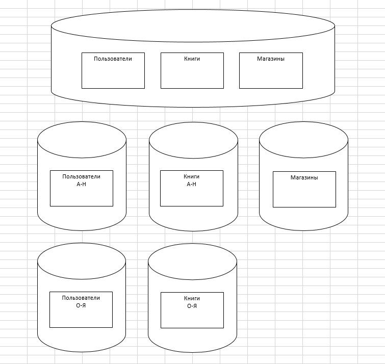

# Домашнее задание к занятию "`12.7. «Репликация и масштабирование. Часть 2»`" - `Живарев Игорь`

### Задание 1

- Репликация - подразумевает копирование данных между серверами. При использовании такого метода выделяют два типа серверов: master и slave. Мастер используется для записи или изменения информации, слейвы — для копирования информации с мастера и её чтения. Чаще всего используется один мастер и несколько слейвов, так как обычно запросов на чтение больше, чем запросов на изменение. Главное преимущество репликации — большое количество копий данных. Так, если даже головной сервер выходит из строя, любой другой сможет его заменить. Однако как механизм масштабирования репликация не слишком удобна. Причина тому — рассинхронизация и задержки при передаче данных между серверами. Чаще всего репликация используется как средство для обеспечения отказоустойчивости вместе с другими методами масштабирования. Конфигурация активный master-сервер и пассивный репликационный slave-сервер имеет только одно преимущество, это простота/дешевизна реализации.

- Распределённое реплицируемое блочное устройство - DRBD (Distributed Replicated Block Device) — это блочное устройство, предназначенное для построения отказоустойчивых кластерных систем на операционной системе Linux. DRBD занимается полным отражением (mirroring) по сети всех операций с блочным устройством. Можно считать, что DRBD это сетевой RAID-1. DRBD берёт данные, записывает их на локальный диск и пересылает на другой хост. На другом хосте они тоже записываются на диск. Помимо DRBD в кластере должно быть ещё два важных компонента: cluster membership service (в качестве которого чаще всего выступает heartbeat); приложение, работающее поверх распределённого блочного устройства.
DRBD работает как модуль ядра Linux. В других операционных системах DRBD использоваться не может. В качестве альтернативы DRBD для OpenSolaris можно рассмотреть Sun StorageTek Availability Suite (сокращённо AVS) , а в FreeBSD - HAST.

- Сеть хранения данных (SAN) — это выделенная высокоскоростная сеть или подсеть, которая соединяет между собой и представляет общие пулы устройств хранения данных для нескольких серверов.
SAN — это сеть накопителей, к которой обращается сеть серверов.SAN обычно используется для консолидации хранилищ.рассмотрим центр обработки данных с сотнями серверов, на каждом из которых запущены виртуальные машины, которые можно разворачивать и перемещать между серверами по желанию. Если данные для каждой рабочей нагрузки хранятся на том же локальном хранилище, то их также нужно будет перемещать, если рабочая нагрузка переносится на другой сервер или восстанавливается, если сервер выходит из строя. Вместо того чтобы пытаться организовать, отслеживать и использовать физические диски, расположенные на отдельных серверах, компания может переместить данные на выделенную подсистему хранения с возможностью коллективного доступа к хранилищу, управления и защиты.
SAN также может повысить доступность хранилища. Поскольку SAN, по сути, представляет собой сетевую структуру взаимосвязанных компьютеров и устройств хранения, нарушение одного сетевого пути обычно может быть компенсировано за счет включения альтернативного пути через структуру SAN. Таким образом, неисправность одного кабеля или устройства не делает хранилище недоступным для корпоративных рабочих нагрузок. Кроме того, возможность рассматривать хранилище как единый ресурс может улучшить использование хранилища, исключив «забытые» диски на недоиспользуемых серверах. Вместо этого, SAN предлагает центральное место для всех хранилищ и позволяет администраторам объединять устройства хранения в пулы и управлять ими совместно.

---

### Задание 2

# Вертикальный шардинг

Каждая таблица распологается на отдельном сервере

# Горизонтальный шардинг

Таблица "Пользователи" разбита на два сервера, на одном фамилии пользователей с А по Н на втором с О по Я.
Таблица "Книги" разбита на два сервера, на одном наименования книг с А по Н на втором с О по Я.
Таблица "Магазины" оставлена лежит на отдельном сервере целеком. При необходимости можно разбить аналогичным образом по Названию магазина или по городу нахождения.

